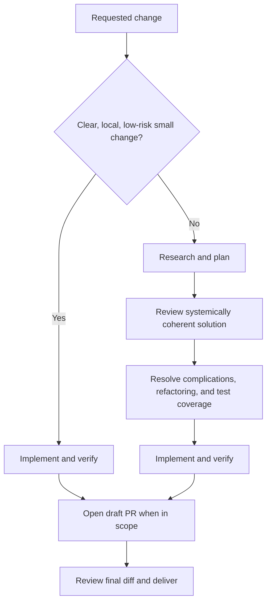

# Dev Task

Optimize for long-term cohesion, low coupling, clear ownership, and localized future change—not the smallest immediate diff. Fix problems at the boundary that owns the responsibility, even when doing so requires a larger change now.

Apply the Pareto principle to total system cost: seek most of the outcome with the least justified complexity, and add complexity only when its present and future value exceeds its cost. Evaluate change surface over the system's plausible evolution rather than the current diff alone; do not generalize for speculative futures.

## Route the Change

Inspect enough repository context to classify the change from evidence rather than from the apparent size of the request.

Treat the work as a **small change** only when all of the following are true:

- the required outcome and invariants are clear;
- the change is local and follows an established pattern;
- the affected subsystem clearly owns the behavior or invariant;
- no material architecture, data, API, compatibility, security, or operational decision is involved;
- the affected behavior and validation are obvious;
- implementation is low-risk and readily reversible.

For a small change, inspect the affected code, implement it directly, run the relevant validation, and report the result. Do not create a plan artifact, decision matrix, or research phase merely for ceremony.

If any condition is false, use the reviewed path below. If repository evidence still leaves materially different interpretations, ask one focused question before choosing. Resolve reversible implementation details independently.

## Research and Plan

### Research the System

Inspect the relevant code, tests, documentation, history, and established conventions. Identify:

- the violated behavior or invariant and the subsystem that owns it;
- the root cause rather than only the visible symptom;
- current behavior, integration boundaries, and changes spanning unrelated modules that may reveal misplaced responsibility;
- constraints, risks, and unknowns;
- existing concepts or utilities to reuse.

Use official or upstream documentation when unfamiliar external behavior materially affects the implementation. Stop researching when the plan is grounded; do not collect context without a decision it can inform.

### Create and Review the Plan

Define:

- the observable outcome;
- invariants and compatibility requirements;
- in-scope and out-of-scope work;
- implementation steps;
- evidence that will prove completion.

Review the plan before coding. Challenge whether it:

- fixes the problem in the subsystem that owns the responsibility or invariant instead of adding a workaround where the symptom appears;
- preserves or improves cohesion, low coupling, clear ownership, and localization of likely future changes, even when that requires a larger diff now;
- evaluates cumulative change surface and future blast radius across plausible evolution rather than optimizing only the current change;
- reuses existing concepts instead of creating parallel ones, and consolidates only concepts with compatible ownership, invariants, and reasons to change;
- introduces an abstraction only when it removes more complexity than it adds;
- keeps total complexity proportional to demonstrated value and avoids speculative generalization or unrelated cleanup.

Revise the plan when the review finds a more coherent or lower-lifecycle-cost solution. Use an independent reviewer only when breadth or risk justifies the coordination cost; otherwise perform the review directly.

### Resolve Consequential Complications

Use a decision matrix only for genuine forks that materially affect behavior, architecture, data, compatibility, risk, or system cost:

| Decision | Options | Choice | Rationale and Cost |
| --- | --- | --- | --- |
| ... | ... | ... | ... |

Do not turn ordinary implementation details into decisions. If no consequential fork exists, proceed without a matrix.

### Evaluate Refactoring Options

Identify refactoring opportunities revealed by the task and decide explicitly whether to include, defer, or reject them:

| Option | Value | Cost and Risk | Decision |
| --- | --- | --- | --- |
| ... | ... | ... | Include / Defer / Reject |

Include a refactor when it is required to repair ownership or materially reduces cumulative complexity, coupling, duplication, risk, or future blast radius. Surface other opportunities explicitly, but do not expand scope merely because adjacent code could be cleaner.

### Plan Test Coverage

Define the smallest test set that proves the requested behavior and protects the relevant risk:

- observable behavior, business logic, state transitions, or data transformations;
- regression coverage for a bug or changed rule;
- affected integration boundaries, side effects, and relevant failure paths;
- required typecheck, lint, build, migration, or runtime checks.

Prefer semantic assertions against stable structured outcomes, identifiers, statuses, and effects. Do not freeze complete messages, prompt wording, documentation copy, incidental implementation details, or arbitrary text. Assert exact wording only when it is an explicit product, protocol, legal, accessibility, or localization contract; keep such assertions narrow.

### Persist the Plan When Useful

Create `<repo-root>/.dev-tasks/<name>.md` when the reviewed path is decision-heavy, spans multiple steps or subsystems, or needs durable handoff. Keep a short task in the active plan instead of creating a file.

When persisted, record the outcome, invariants, scope, reviewed implementation plan, consequential decisions, refactoring choices, test coverage plan, and an initially empty deviation log. Use the deviation log only when implementation changes a material decision or scope boundary.

## Code and Verify

Implement the reviewed solution using repository patterns. Add or update tests before implementation when the repository workflow or task requires test-first development. Keep unrelated changes out of the diff.

Run the smallest checks that prove the changed behavior first, then the broader relevant suite. Read the results rather than assuming success. If implementation reveals a material plan error, update the plan or deviation log and choose a systemically coherent correction before continuing.

## Open and Review the Pull Request

When PR delivery is requested or established for the task and the repository remote is available:

1. complete local validation;
2. open or update a draft pull request;
3. review the full PR diff as a reviewer for correctness, scope, tests, security, compatibility, and unnecessary complexity;
4. fix material findings and rerun affected checks;
5. update the PR summary and readiness state as requested.

For local-only work, perform the same final diff review without creating a pull request. Do not treat opening a PR as proof that the change is complete.

## Report the Result

Lead with the achieved outcome. For a small change, keep the report compact. For reviewed work, include the implementation summary, meaningful changed files, exact validation and results, diff cost, consequential decisions and deviations, PR status when applicable, and remaining risks or deferred work.

Separate verified facts from reviewer judgment. Omit empty sections instead of adding boilerplate.
