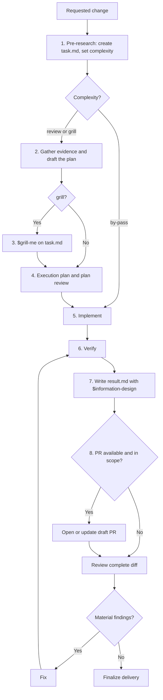

# Dev Task

Deliver the requested behavior at the lowest justified total cost. Four rules shape every step:

- **Change scope:** prefer a local change. Widen it only to protect correctness, ownership, or compatibility, or to materially reduce total complexity or risk.
- **Process scope:** give each task the lightest complexity that fits. `by-pass` implements directly, `review` adds evidence and a reviewed plan, and `grill` adds a `$grill-me` interview for questions only the user can settle.
- **Delegation:** the main session is the orchestrator and keeps the task context, every decision, and all user interaction. Delegate only bounded roles whose output you can verify; `by-pass` delegates nothing.
- **Completion:** only fresh verification evidence and a complete-diff review without material findings prove completion; neither a commit nor an open PR does.

## Workflow



## Task Folder

Every task keeps its state in `<repo-root>/.dev-tasks/<task>/`, where `<task>` is `<YYYY-MM-DD>-<slug>`: the creation date and a short kebab-case slug. Reuse an existing folder only to resume that task. Commit the folder with the change; only the orchestrator writes it, and only in the task's own checkout. If the repository's `.gitignore` still ignores `.dev-tasks/`, an entry that earlier versions of this skill added, remove that entry.

| Path | Content | Complexity | Template |
| --- | --- | --- | --- |
| `task.md` | Status, complexity, request, pre-research, and change contract; evidence, the four-part plan, and review rounds for `review` and `grill`; interview outcomes for `grill`. | All | [templates/task.md](templates/task.md) |
| `execution-plan.md` | Stages, waves, write scopes, executors, and the verification schedule. | `review`, `grill` | [templates/execution-plan.md](templates/execution-plan.md) |
| `stages/<stage>.md` | One spec per worker stage: its brief, state, workspace, branch, and the accepted report. | Stages assigned to a worker | [templates/stage.md](templates/stage.md) |
| `result.md` | The implementation summary from step 7. | All | — |

`task.md` starts with this frontmatter:

```yaml
---
status: draft
complexity: null
---
```

`complexity` stays `null` until step 1 sets `by-pass`, `review`, or `grill`. It may only rise later, with the reason in the deviation log. A raise returns `status` to `draft` and resumes planning: at step 2 for `review`, at step 3 for `grill`.

`status` is required and accepts only these values:

| Status | Meaning |
| --- | --- |
| `draft` | Pre-research, evidence gathering, planning, or plan review is in progress. |
| `todo` | The reviewed plan is ready for implementation. |
| `progress` | Implementation or verification is in progress. |
| `pr` | A pull request is open and remains the active delivery surface. |
| `done` | Verification and final review are complete, with no required work remaining. |

`review` and `grill` use the lifecycle `draft -> todo -> progress -> pr -> done`. `by-pass` has no plan to review and uses `draft -> progress -> pr -> done`. Skip `pr` for local-only work. Update the existing field when the task changes state; the only backward move is the return to `draft` when complexity rises. Do not add custom values or retain a status history.

## Roles and Delegation

The main session is the orchestrator: it owns routing, evidence synthesis, the plan, decisions, user dialog, task status, integration, verification, the summary, and delivery. Subagents take bounded roles from self-contained briefs and return evidence that the orchestrator verifies.

| Role | Step | Dispatch when | Agent | Access |
| --- | --- | --- | --- | --- |
| Explorer | 2 | Two or more independent questions each need broad reading, and the plan needs only their conclusions. | Built-in read-only explorer | Read-only |
| Plan reviewer | 4 | The task is `grill`, or `review` with an execution plan that assigns a stage to a worker. | `dev-task-reviewer` | Read-only |
| Worker | 5 | The execution plan assigns a stage to a worker. | `dev-task-worker` | The stage's write scope |
| Diff reviewer | 8 | Every `review` or `grill` delivery. | `dev-task-reviewer` | Read-only |

Before the first dispatch, read [references/subagents.md](references/subagents.md) and build every brief from it. It also maps the agents to each platform and defines the fallback when they or subagents are unavailable.

## 1. Pre-research and Complexity

Start with a quick inspection, without writing files, that settles two decisions first.

- **Split.** When a request combines parts that can be delivered and reviewed independently and at least one part needs `review` or `grill`, propose one task per part, each with its own task folder, worktree, and PR, so the parts can proceed as parallel sessions. Handle a request whose parts all qualify for `by-pass` as one task. Coupled parts of one delivery stay in one task and become stages of its execution plan.
- **Checkout.** Recommend a separate Git worktree for each task, including `by-pass` work, when the repository and environment support it. Work in an existing task-specific worktree if one is already assigned. Preserve uncommitted work in the current checkout when creating a new one; if the task builds on that work, copy it into the new worktree or stay in the current checkout.

Then create the task folder in the task's checkout from [templates/task.md](templates/task.md), finish the pre-research, and record what you inspected, why the complexity fits, and a compact change contract.

Use `by-pass` only when every condition holds:

- outcome and invariants are unambiguous;
- owning subsystem and implementation pattern are clear;
- change is local and creates no material architecture, data, API, compatibility, security, or operational decision;
- validation is obvious;
- change is low-risk and readily reversible.

Use `review` when any condition fails and evidence, plus at most one focused question to the user, can settle every consequential decision. Use `grill` when the decisions hinge on more than one question that only the user can settle, such as intent, domain terms, or trade-offs with no evidence-based winner. Size alone does not qualify.

Decide reversible details independently. Ask one focused question only when a missing choice would change behavior, compatibility, risk, or scope; for `grill`, collect such questions for the interview instead.

## 2. Gather Evidence and Draft the Plan

For `review` and `grill`, collect the evidence the template's Evidence section lists and record it in `task.md`. Treat required edits across unrelated modules as evidence that responsibility may be misplaced. Consult official or upstream documentation when external behavior affects the solution. Separate fact from inference when uncertainty could change the plan. Delegate independent broad questions to explorers, then open the cited evidence for every fact the plan will rely on. Stop when remaining unknowns cannot change the solution or its proof.

Then write the four plan sections in `task.md` as the template specifies: Minimal Reasonable Solution, Matrix Decisions on Complications, Refactoring Options, and Test Coverage Plan. If evidence leaves one question that only the user can settle, ask it and record the answer in the matrix; if more remain, raise the complexity to `grill` and list them under Open Questions.

## 3. Grill

For `grill`, run `$grill-me` against `task.md` once the draft plan and Open Questions exist. Record each answer and the decision it produced under Grill Outcomes, and update the plan sections it changes. If the user stops the interview early, record the unresolved questions as explicit assumptions in the matrix. When `$grill-me` is unavailable, run the interview yourself: take the Open Questions one at a time in dependency order, recommend an answer for each, and continue until each is resolved.

## 4. Execution Plan and Plan Review

For `review` and `grill`, write `execution-plan.md` from [templates/execution-plan.md](templates/execution-plan.md): stages, waves, write scopes, executors, and the verification schedule. Before planning a parallel wave, read [references/parallel-execution.md](references/parallel-execution.md).

Review each part separately, then check that they agree:

- the solution satisfies the change contract and fixes the owning boundary;
- the matrix exposes material complications, viable options, and explicit decisions;
- refactor decisions match the chosen scope and solution;
- the test plan covers every invariant, decision, failure path, and material risk;
- the execution plan covers every solution step, keeps each wave within the wave rules, and schedules every check once, at a point where its failure can still be traced to its stage.

Reject a plan with a missing section, collapsed matrix fields, unsupported `Not applicable`, unresolved consequential decision, uncovered risk, a wave that breaks the wave rules, or a verification schedule that repeats full-suite runs. Dispatch the plan reviewer when the Roles table calls for one; otherwise review both files yourself against this checklist and the templates' rules. Record each review round and the disposition of every finding under Reviews in `task.md`. Revise until the plan passes; do not code before it does. Then set `status: todo`.

## 5. Implement

Set `status: progress` immediately before implementation begins.

For `by-pass`, implement directly. For `review` and `grill`, follow the execution plan: implement orchestrator stages yourself; for each worker stage, write its spec to `stages/<stage>.md` from [templates/stage.md](templates/stage.md) and dispatch the worker with that spec as described in [references/subagents.md](references/subagents.md); run parallel waves as described in [references/parallel-execution.md](references/parallel-execution.md). Accept a returned stage by reading its report and diff; its checks run where the verification schedule places them.

Follow repository patterns and keep unrelated changes out of the diff. For a bug, add a regression test that fails on the original defect when practical. Follow test-first development when the user or repository requires it.

If implementation invalidates the plan, including a worker's `NEEDS_DECISION` or a conflict between parallel stages, stop and revise the affected plan sections. If a `by-pass` change stops meeting any `by-pass` condition, raise the complexity to `review` and continue from step 2. Record every material deviation in the deviation log before continuing.

## 6. Verify

Run each check once, at the most integrated point where its failure can still be traced cheaply, and spend the saved time on fixes rather than repeated runs. For `review` and `grill`, follow the verification schedule in `execution-plan.md`; for `by-pass`, run the targeted checks, then the relevant suite once. Finish on the integrated task branch with the static checks, the relevant suite, and every stage check the suite does not cover; after a fix, rerun the failed checks, then that final run once. Read the output and fix failures. Prove the observable outcome and every invariant with fresh evidence; subagent reports are not evidence.

Inspect the task diff and working tree for missing, unrelated, or accidental changes.

## 7. Summarize into result.md

After verification, use `$information-design` to build the implementation summary from the actual diff and evidence, not from the original plan, and save it as `result.md`. Lead with the outcome, then include only what helps the reader assess the change:

- **System context**, before the change details: how the affected part works (responsibility, relevant components or boundaries, important control or data flow) and where the change fits, limited to what the reader needs to understand the change and its impact — one or two sentences for a simple local edit;
- what changed, where, and why;
- exact validation commands and results;
- diff cost: size and what justified it;
- consequential decisions and deviations;
- remaining risks and deferred work.

Keep `by-pass` summaries compact. Separate verified fact from reviewer judgment. Omit empty sections and process narration. Use `result.md` as the PR description and the basis of the final report.

## 8. Deliver and Review

Recommend a pull request as the default delivery for each task when a remote and PR access are available. If the user requested local-only work or PR creation is unavailable, deliver locally and state why there is no PR.

For PR delivery:

1. open or update the draft PR with `result.md` as its description, then set `status: pr` only after the PR exists;
2. review the complete PR diff for correctness, scope, tests, security, compatibility, unnecessary complexity, and accidental edits: dispatch the diff reviewer for `review` and `grill`, review it yourself for `by-pass`, verify every finding against the code before acting on it, and for `review` and `grill` record the round under Reviews in `task.md`;
3. fix material findings and rerun affected checks;
4. regenerate `result.md` with `$information-design` when the diff or evidence changes;
5. update the PR description and readiness state.

Commit task-folder bookkeeping, such as a status change, a Reviews entry, or a regenerated `result.md`, separately after the review; a commit that touches only `.dev-tasks/<task>/` needs no re-review.

For local-only work, perform the same diff review and deliver `result.md` without opening a PR. Finalize only when no material finding remains and `result.md` matches the verified diff. Set `status: done` only at that point, after either the `progress` or `pr` state, in the last bookkeeping commit before the PR merges or the local delivery ends. Add the PR link and status to the final report when applicable.
